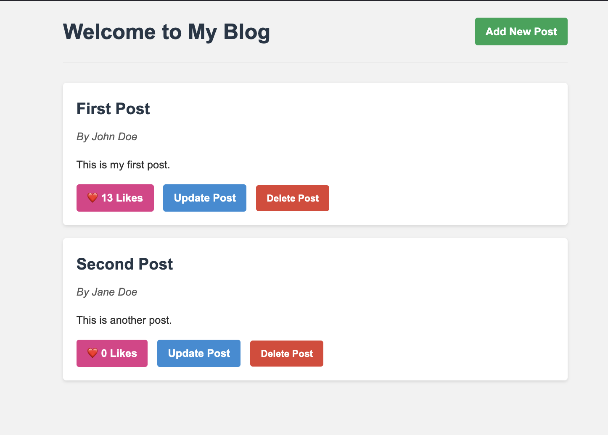
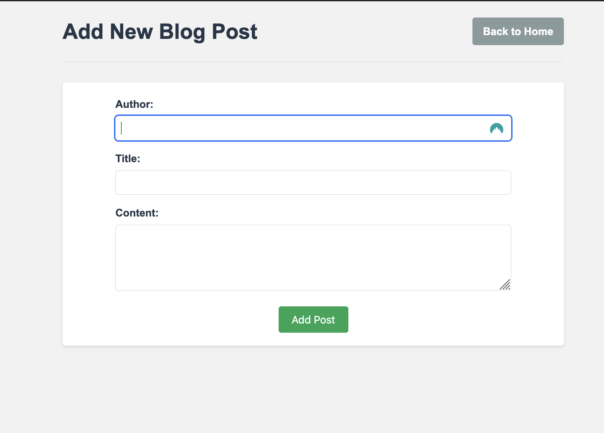
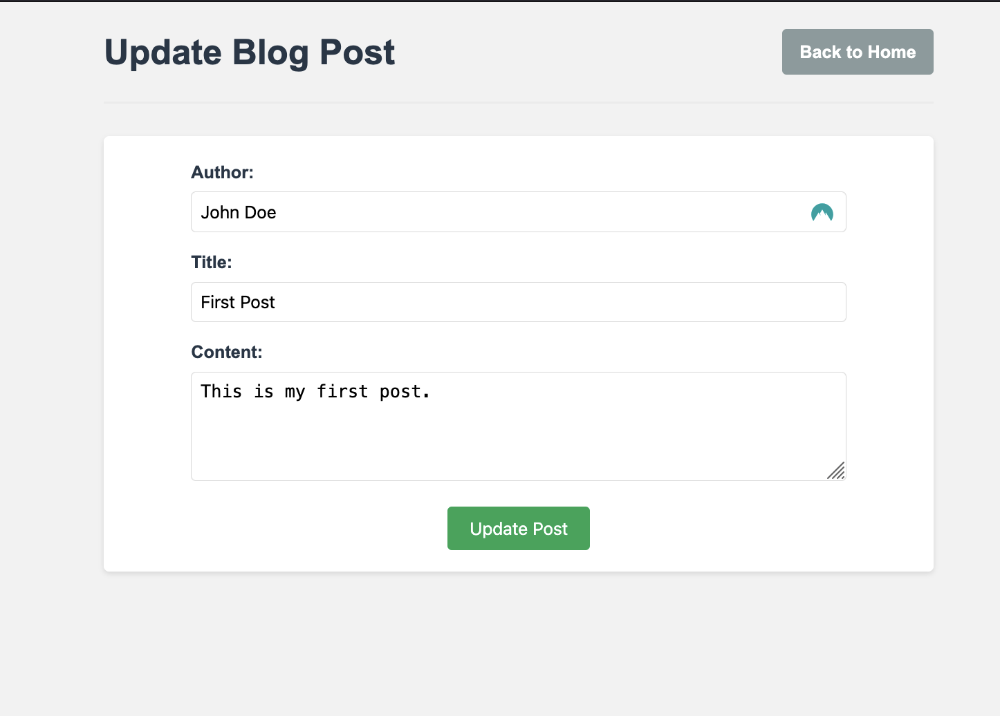

# Flask Blog Application

A dynamic blog application built with Flask, demonstrating core web development concepts and CRUD operations.

## 🎯 Project Overview

This blog application is a practical implementation of a web-based content management system that allows users to create, read, update, and delete blog posts. It also includes additional features like post liking functionality.


*Figure 1: Home page displaying all blog posts with like functionality*

## 🎓 Learning Objectives

Through this project, you'll gain hands-on experience with:

1. **Flask Framework Fundamentals**
   - Route handling and URL mapping
   - Template rendering with Jinja2
   - HTTP methods (GET, POST)
   - Request handling and form processing

2. **Data Management**
   - JSON file operations for data persistence
   - CRUD operations implementation
   - Data structure design and management

3. **Web Development Concepts**
   - Frontend-Backend integration
   - Static file handling (CSS)
   - Template inheritance
   - User interaction handling

4. **Python Programming**
   - Type hints and documentation
   - Error handling
   - File I/O operations
   - List and dictionary manipulation

## 🛠️ Technical Stack

- **Backend**: Python Flask
- **Frontend**: HTML, CSS
- **Data Storage**: JSON file
- **Template Engine**: Jinja2

## 📁 Project Structure

```
master_blog/
├── app.py              # Main Flask application file
├── blog_posts.json     # Data storage file
├── templates/          # HTML templates
│   ├── index.html     # Home page template
│   ├── add.html       # Add post form template
│   └── update.html    # Update post form template
├── static/            # Static files
│   └── styles.css     # CSS styling
└── assets/            # Screenshots and documentation assets
    ├── index.png      # Home page screenshot
    ├── add_post.png   # Add post form screenshot
    └── update.png     # Update post form screenshot
```

## 🚀 Getting Started

### Prerequisites

- Python 3.x
- Flask

### Installation

1. Clone the repository:
   ```bash
   git clone <repository-url>
   cd master_blog
   ```

2. Install dependencies:
   ```bash
   pip install flask
   ```

3. Run the application:
   ```bash
   python app.py
   ```

4. Access the application:
   Open your browser and navigate to `http://localhost:5000`

## 💡 Features

1. **View Posts**
   - Browse all blog posts on the home page
   - See post details including author, title, and content
   - View like counts for each post

2. **Create Posts**
   - Add new blog posts using a dedicated form
   - Input fields for author, title, and content


*Figure 2: Form for adding new blog posts*

3. **Update Posts**
   - Edit existing posts
   - Modify author, title, and content


*Figure 3: Form for updating existing blog posts*

4. **Delete Posts**
   - Remove unwanted posts from the blog

5. **Like Posts**
   - Interactive like button for each post
   - Real-time like count update

## 🧪 Testing

### Manual Testing Steps

1. **Create a New Post**
   - Click "Add Post" button
   - Fill in author, title, and content
   - Submit and verify post appears on home page

2. **Update a Post**
   - Click "Update" on an existing post
   - Modify fields
   - Save and verify changes

3. **Delete a Post**
   - Click "Delete" on an existing post
   - Verify post is removed from home page

4. **Like Functionality**
   - Click "Like" button on a post
   - Verify like count increases
   - Refresh page to ensure persistence

### Common Issues and Solutions

1. **Template Not Found Error**
   - Ensure all template files are in the `templates` directory
   - Check file permissions
   - Verify correct file names (case-sensitive)

2. **Static Files Not Loading**
   - Confirm `static` directory exists
   - Check CSS file path in HTML templates
   - Verify file permissions

3. **JSON File Issues**
   - Ensure `blog_posts.json` exists and is writable
   - Check JSON file format
   - Verify file permissions

## 🔍 Code Structure

### Key Components

1. **Route Handlers**
   - `/` - Display all posts
   - `/add` - Add new posts
   - `/update/<post_id>` - Update existing posts
   - `/delete/<post_id>` - Delete posts
   - `/like/<post_id>` - Handle post likes

2. **Data Functions**
   - `load_posts()` - Read from JSON file
   - `save_posts()` - Write to JSON file

3. **Templates**
   - Base layout and styling
   - Form handling
   - Dynamic content rendering

## 📝 Best Practices Demonstrated

1. **Code Organization**
   - Modular structure
   - Clear separation of concerns
   - Consistent naming conventions

2. **Documentation**
   - Comprehensive docstrings
   - Type hints
   - Clear comments

3. **Error Handling**
   - Graceful error management
   - User-friendly error messages
   - Data validation

## 🤝 Contributing

Feel free to fork this project and add your own features. Some ideas for enhancement:

- User authentication
- Comments system
- Categories/Tags
- Search functionality
- Image upload support

## 📄 License

This project is licensed under the MIT License - see the LICENSE file for details.

---

Happy coding! 🚀 